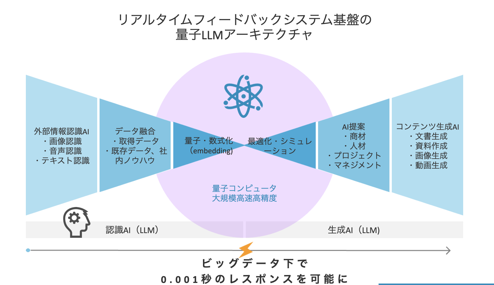
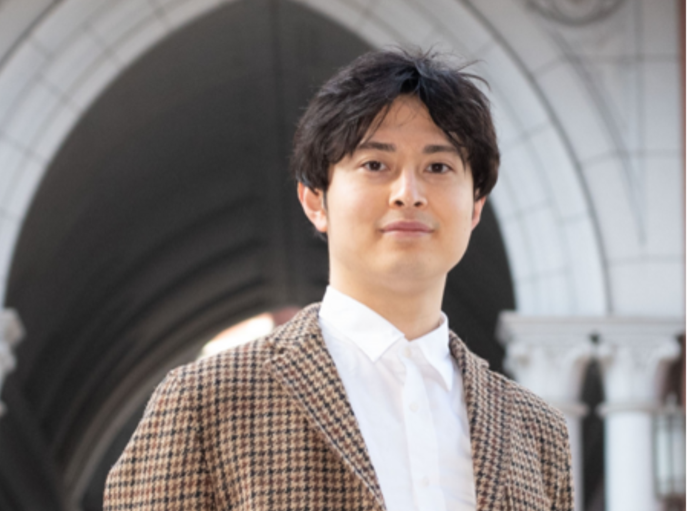
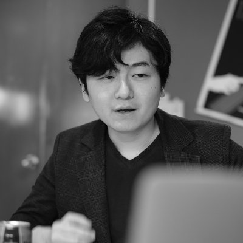
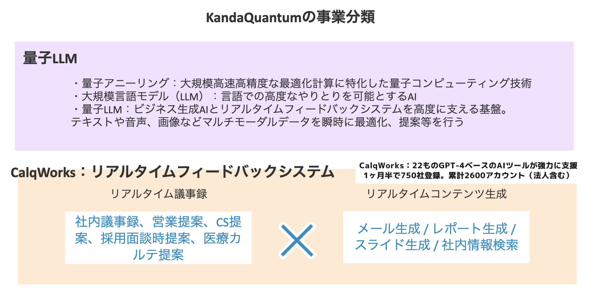

# 社内運用：KandaQuantumと慶應義塾大学、量子LLMを活用した共同研究開始
## ESG投資ポートフォリオ最適化AIと非構造情報からのESG投資ポートフォリオを実現
### 株式会社KandaQuantum（代表: 元木大介）は、慶應義塾大学SFC研究所 笹埜健斗氏と共同で量子LLMとAIを活用した研究を開始します。ESG投資ポートフォリオ最適化AIと非構造情報からのESG投資ポートフォリオ自動生成を可能にします。

**目次**
1. プレスリリースの目的
2. KandaQuantumと慶應義塾大学の共同研究の背景
3. 量子コンピューターと大規模言語モデル（LLM）について
4. リアルタイムAI基盤 量子LLMのアーキテクチャ
5. 量子LLMとESG投資ポートフォリオ最適化AIの活用方法
6. 今回の共同研究による効果と期待

**1. プレスリリースの目的**

プレスリリースは、KandaQuantumと慶應義塾大学が共同で量子LLMとAIの活用を開始することを正式に発表します。この共同研究は、ESG投資ポートフォリオの最適化と非構造情報からのESG投資ポートフォリオ自動生成という二つの重要な課題に対する解決策を提供することを目指しています。

**2. KandaQuantumと慶應義塾大学の共同研究の背景**

KandaQuantumと慶應義塾大学は、ESG投資ポートフォリオ最適化AIと非構造情報からのESG投資ポートフォリオ自動生成を実現するための共同研究を開始します。この研究の背景には、ESG投資における非構造データの多さ、その取り込みの困難さ、データ量の多さによる処理の難しさ、そしてESG投資における提案資料作成の難しさなどがあります。これらの課題を解決するため、ESG投資の需要が高まる中で、投資ポートフォリオの最適化と非構造情報の活用がビジネスの効率化に寄与すると考えています。

**3 量子コンピューターと大規模言語モデル（LLM）について**

量子コンピューターは、量子力学の原理を利用して情報を処理する新しい種類のコンピューターです。量子ビット（qubit）と呼ばれる情報の単位を使用し、これらのqubitは同時に多数の異なる状態を持つことができます。これにより、量子コンピューターは一度に多数の計算を行うことができ、特定の問題に対しては古典的なコンピューターよりもはるかに高速に解を見つけることが可能です。

一方、大規模言語モデル（LLM）は、人間のように自然言語を理解し、生成する能力を持つAIです。大量のテキストデータから学習を行い、その結果、新しいテキストを生成したり、質問に答えたり、文章の要約を作成したりすることができます。LLMは、その能力を活用して、例えばカスタマーサポートの自動化、コンテンツ生成、情報検索など、様々なタスクを効率化することが可能です。

量子コンピューターとLLMの組み合わせは、これら二つの強力な技術を統合し、新たな可能性を開くことが期待されています。量子コンピューターの高速な計算能力とLLMの自然言語処理能力を活用することで、より複雑で高度な問題解決が可能となります。

**4. リアルタイムAI基盤 量子LLMのアーキテクチャ**

量子LLMは、以下の要素から構成されています。

1. 認識AI: 画像認識、音声認識、テキスト認識など行い、それらの外部データと既存データを融合します。
2. 量子技術: 量子・数式化（embedding）、最適化・シミュレーションが含まれます。これらの技術は大規模で高速かつ高精度な計算を可能にします。
3. 生成AI (LLM): 商材、人材、プロジェクト、マネジメントなどを提案します。文書生成、資料作成、画像生成、動画生成などを行います。

これらすべての要素が統合され、ビッグデータ下で0.001秒のレスポンスを可能にし量子LLMの全体像を形成します。

**5. 量子LLMとESG投資ポートフォリオ最適化AIの活用方法**

量子とLLMの組み合わせにより、ESG投資ポートフォリオの最適化が可能となります。具体的には、量子の高速な計算能力とLLMの学習能力を駆使し、投資ポートフォリオのリスクとリターンを最適化します。量子LLMの各要素、特に外部情報認識AI、リアルタイムフィードバックシステム基盤、データ融合、量子・数式化（embedding）、最適化・シミュレーション、AI提案、生成AI (LLM)、コンテンツ生成AI、量子コンピュータ、大規模高速高精度の量子LLMが、ESG投資ポートフォリオの最適化にどのように寄与するかを詳細に説明します。

外部情報認識AIは、市場の動向やESG関連のニュースなど、投資判断に必要な情報を収集します。リアルタイムフィードバックシステム基盤は、これらの情報をリアルタイムで分析し、投資ポートフォリオの最適化に貢献します。データ融合は、収集した情報を統合し、より精緻な投資分析を可能にします。量子・数式化（embedding）は、これらの情報を量子コンピュータが解析できる形に変換します。最適化・シミュレーションは、可能な投資シナリオをシミュレーションし、最適な投資ポートフォリオを提案します。

AI提案は、最適な投資ポートフォリオを提案します。生成AI (LLM)は、大量のデータを高速に処理し、投資家が迅速に投資判断を下せるようにします。コンテンツ生成AIは、投資レポートや分析結果の資料を自動生成します。さらに、投資家や投資営業担当が見るポートフォリオの詳細情報や説明などのドキュメントも自動生成します。量子コンピュータは、大規模で高速かつ高精度な計算を可能にし、投資ポートフォリオの最適化を実現します。量子LLMは、これらすべての要素を統合し、量子LLMの全体像を形成します。

**6. 今回の共同研究による効果と期待**

本共同研究により、ESG投資ポートフォリオの最適化と非構造情報からのESG投資が可能となり、投資家にとって有益な情報提供が期待されます。また、この研究が成功すれば、量子コンピューティングとLLMの可能性がさらに広がり、新たなビジネスチャンスが生まれます。

慶應義塾大学SFC研究所 笹埜健斗

・2011年、第19回国際哲学オリンピック国内予選金賞受賞

・第19回国際哲学オリンピック出場（オーストリア・ウィーン）[4] 。

・2018年、京都大学法学部卒業後、東京大学大学院情報学環・学際情報学府入学

・2021年、東大発研究開発型スタートアップ 株式会社Scrumy代表取締役

・2022年、一般社団法人サステナビリティ総合研究所代表理事。

・2023年、慶應義塾大学SFC研究所所員

株式会社KandaQuantum 代表 元木大介

・東京大学大学院理学系研究科物理学專攻修了

・東京大学物性研究所にて量子物性研究に従事

・KandaQuantum Inc.を創業、代表取締役に就任

・Jij Inc.にて量子技術の先進的な応用技術研究に従事

・1.2万人集結IVS京都にて生成AIピッチで審査員賞受賞

---

**会社概要**

株式会社KandaQuantumは、CEO元木大介のもと、「共創の基盤を創る」をミッションに人々の働き方をAIと量子コンピューター技術で変革します。また、統合ジェネレーティブAIツールとして26のAIツール群を提供するCalqWorksを展開しています。詳細は

[https://calqworks.studio.site/](https://calqworks.studio.site/)

をご覧ください。

**本件に関する報道関係者からのお問合せ先**

株式会社KandaQuantum 広報担当

メールアドレス：press@kandaquantum.co.jp

株式会社KandaQuantum HP: [https://kandaquantum.com](https://kandaquantum.com)
